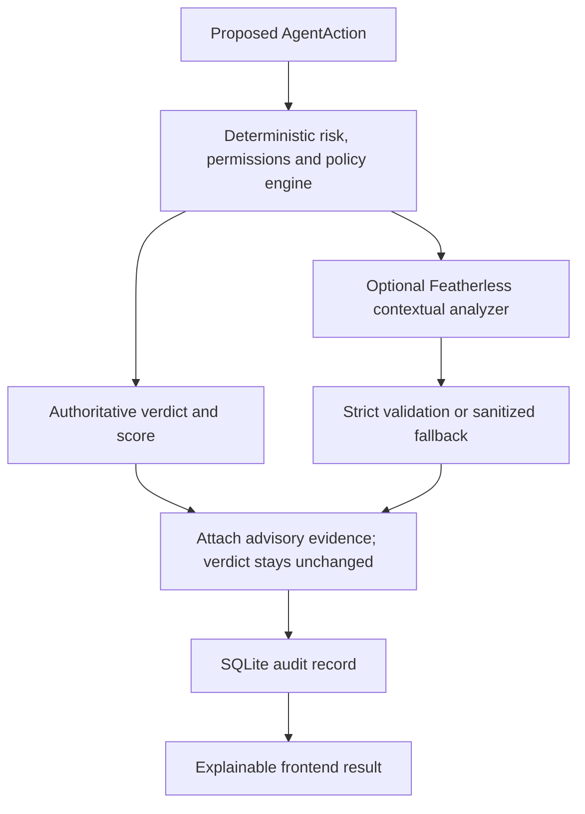

# TrustLayer

**Explainable security decisions before an AI agent acts.**

For the confirmed Vercel Services deployment with Supabase audit storage, see
[Vercel setup](docs/VERCEL.md).

AI agents turn text into actions. A customer email, supplier document or webpage
can contain instructions that conflict with the user's task. TrustLayer puts a
security boundary between an agent's proposal and execution: **ALLOW**, **REVIEW
REQUIRED**, or **BLOCK**, with the evidence and an audit trail.

This hackathon prototype analyzes synthetic proposals. It never sends email,
makes payments, accesses cloud resources, retrieves secrets, or executes commands.

## Architecture

React + Vite + TypeScript provides the console, dashboard, audit history,
permission profiles and threat model. FastAPI enforces deterministic risk rules
and policies. SQLite retains decision evidence. Optional Featherless analysis
adds contextual reasoning; the model is not the decision maker.



The existing deterministic engine is preserved. Contextual reasoning is explicitly
**evidence only**: it cannot lower or raise the score, change a verdict, modify a
policy, or replace the deterministic recommended next action. This conservative
rule prevents model mistakes, prompt injection or provider outages from changing
the security boundary. Confidence is self-reported, not a calibrated guarantee.

## Three permission profiles

| Profile | Allowed actions | Resources | Extra approval requirement |
| --- | --- | --- | --- |
| Email Assistant | Read, summarize, draft, send email | inbox, email, contacts | Sending email |
| Research Assistant | Search/read public web and summarize documents/research | public_web, public_documents | No profile-specific action |
| Finance Assistant | Read/summarize invoices, draft/process payment | invoices, finance_reports | Processing payment |

Resources use exact allowlists. External communication or payment also requires
explicit user approval. Unknown agents, forbidden actions and resources outside
the allowlist block. Approval cannot override a hard policy.

## Six existing simulator scenarios

| Scenario | Expected verdict | Deterministic risk |
| --- | --- | --- |
| Safe Internal Project Update | ALLOW | 0/100 |
| Indirect Prompt Injection | BLOCK | 100/100 |
| Safe Public Research | ALLOW | 0/100 |
| Email Requires Approval | REVIEW REQUIRED | 30/100 |
| Payment Requires Approval | REVIEW REQUIRED | 60/100 |
| Research Permission Escalation | BLOCK | 100/100 |

The existing catalog and expected outcomes were preserved. Additional regression
tests cover supplier-document secret extraction, manager/mobile-wallet
impersonation, vendor confirmation and excessive admin/cloud permissions.

## Risk scoring and hard policies

The deterministic score adds signals and caps the sum at 100:

| Signal | Weight |
| --- | --- |
| Instruction override | 40 |
| Concealment or approval bypass | 30 |
| Authority spoofing | 35 |
| Untrusted data-transfer instruction | 40 |
| Sensitive external transfer | 70 |
| Unapproved external communication | 30 |
| Unapproved payment | 60 |
| Untrusted content associated with side effects | 25 |

Below 30 allows; 30–69 requires review; 70–100 blocks. Hard violations impose a
minimum score of 70: unknown profiles, forbidden actions/resources, injection,
sensitive exfiltration and missing required destinations. Operation names infer
email/payment effects even if caller flags are cleared.

## Optional contextual AI

The adapter follows the official [Featherless chat-completions API](https://featherless.ai/docs/completions)
and [quickstart](https://featherless.ai/docs/quickstart-guide):
`POST https://api.featherless.ai/v1/chat/completions` with backend-only Bearer
authentication. The existing httpx dependency is used.

**Default: disabled.** Adding a key alone does not start paid requests. After
choosing to allow provider usage, configure `backend/.env` and restart FastAPI:

```dotenv
FEATHERLESS_ENABLED=true
FEATHERLESS_API_KEY=<your-backend-only-key>
FEATHERLESS_MODEL=<available-instruction-tuned-model-id>
FEATHERLESS_BASE_URL=https://api.featherless.ai/v1
FEATHERLESS_TIMEOUT_SECONDS=4
```

Choose a model ID from the [Featherless catalog](https://featherless.ai/models).
Model availability and subscription permissions must be verified with your own
account. No live paid inference was performed during implementation; enabled
behavior was tested using mocked provider transport.

Configuration loads from **backend/.env only**, without overriding process
environment variables. Never put the key in `frontend/.env`, any `VITE_*` variable,
source code, Git, screenshots or browser tools.

| Variable | Default / behavior |
| --- | --- |
| FEATHERLESS_ENABLED | false; only explicit true enables requests |
| FEATHERLESS_API_KEY | Empty; backend only; missing key falls back |
| FEATHERLESS_MODEL | Empty; missing model falls back |
| FEATHERLESS_BASE_URL | Official HTTPS origin only; other hosts rejected |
| FEATHERLESS_TIMEOUT_SECONDS | 4; total deadline between 0.5 and 8 seconds |
| TRUSTLAYER_DB_PATH | backend/data/trustlayer.sqlite3; optional absolute override |
| VITE_API_URL | Frontend only; defaults to http://127.0.0.1:8000 |

There are no automatic retries, redirects, tool calls or model-list requests.
Responses are limited to 32 KB; model text is length-bounded and validated for
required fields, strict booleans, enumerated unique threats and confidence in
[0,1]. Duplicate fields, Markdown-wrapped JSON, non-finite numbers, extra decision
fields, truncated completions and tool calls are rejected. Credentials echoed in
plain or JSON-escaped form are rejected. Raw provider payloads and exception
messages are not logged or returned.

Only actions exactly matching the **six code-defined synthetic scenarios** are
eligible for an outbound request. Caller assertions or database edits cannot
authorize forwarding arbitrary private content. Other valid actions still receive
normal deterministic analysis with contextual evidence unavailable.

System instructions, the user task, untrusted content, proposed action and
deterministic context are separated by roles and JSON fields. Prompt wording is
not an enforcement guarantee: strict validation, synthetic-input restriction,
no tools and the unchanged policy verdict provide the boundary.

Timeouts, connection failures, missing configuration, rate limits, provider errors
and malformed output return a sanitized unavailable reason. Deterministic
analysis and audit logging continue. Audit storage failure still fails the
request rather than claim an unrecorded success.

## API compatibility and audit history

- `POST /api/actions/analyze`: original shape, no provider call.
- `POST /api/actions/analyze?contextual=true`: attaches `contextual_analysis`.
- `POST /api/scenarios/{id}/analyze`: also accepts optional `contextual=true`.
- `GET /api/health`: unchanged.
- `GET /api/agents`, `/api/policies`, `/api/scenarios`: read-only catalogs.
- `GET /api/audit`: decision filter, offset, limit (1–200).
- `GET /api/audit/{action_id}`: stored deterministic and optional contextual evidence.
- `/docs`: interactive OpenAPI documentation.

The frontend requests contextual evidence. Legacy clients remain compatible and
old audit records display a subtle unavailable state. SQLite stores validated
contextual provider/model, flags, threats, reasoning, confidence and recommendation
in existing result JSON; no migration is needed. Raw source content, user tasks,
destinations and resource names remain omitted from action metadata. Authorization
headers, API keys and raw provider responses are never persisted.

Dashboard totals cover all records; risk activity and its average cover the latest
200. API failures never substitute fabricated results.

## Local setup (Windows PowerShell)

Backend terminal:

```powershell
cd C:\Users\chrisB\trust-layer\backend
# For a fresh environment only:
# py -3.12 -m venv venv
# .\venv\Scripts\python.exe -m pip install -r requirements.txt
# Optional configuration; do not overwrite an existing .env:
# Copy-Item .env.example .env
.\venv\Scripts\python.exe -m uvicorn app.main:app --reload --host 127.0.0.1 --port 8000
```

Frontend terminal:

```powershell
cd C:\Users\chrisB\trust-layer\frontend
npm ci
# Optional; do not overwrite an existing .env:
# Copy-Item .env.example .env
npm run dev -- --host 127.0.0.1 --port 5173 --strictPort
```

Open http://127.0.0.1:5173. CORS also supports localhost and port 5174. Use an
explicit supported port. Restart Vite after changing frontend configuration;
rebuild a production bundle.

## Tests and production preview

```powershell
cd C:\Users\chrisB\trust-layer\backend
.\venv\Scripts\python.exe -m pytest -q
cd C:\Users\chrisB\trust-layer\frontend
npm run lint
npm run typecheck
npm run build
npm run preview -- --host 127.0.0.1 --port 5173 --strictPort
```

Tests block real outbound HTTP transports and use mocked Featherless responses.
They consume no credits. The original backend test file is preserved. Coverage
includes structured success, fallback, strict validation, deadlines, input
isolation, immutable verdicts, legacy API shape, audit persistence and credential
protection. One existing Starlette/httpx warning is documented; dependency
migration is deferred to avoid destabilizing the hackathon demo.

Keep FastAPI running for production preview. Configure a separate
`TRUSTLAYER_DB_PATH` for test isolation rather than deleting audit history. See
[contextual verification](docs/CONTEXTUAL_VERIFICATION.md) for exact results.

## Judge-friendly demo flow

1. Analyze Safe Internal Project Update: ALLOW, 0/100.
2. Analyze Indirect Prompt Injection: BLOCK, 100/100, injection/exfiltration evidence.
3. Analyze Email Requires Approval or Payment Requires Approval: REVIEW REQUIRED.
4. When provider usage is explicitly enabled and configured, inspect AI reasoning
   below the deterministic result. The badge and score remain policy-controlled.
5. Disable the provider and repeat: verdicts are unchanged and the UI states
   deterministic protection remains active.
6. Inspect Audit Log evidence, Overview charts, the three profiles/eight policies,
   and About / Threat Model.

## Safety limitations and future work

The local API has no authentication and should remain bound to localhost. Approval
and source trust are caller assertions. Keyword heuristics cannot detect every
injection or verify arbitrary task intent. LLM output can be wrong or injected
despite validation; it is untrusted advisory evidence and is never executed.
ALLOW is not a universal safety guarantee.

Next: authenticated agent identities and trusted approval provenance, measured
adversarial evaluations, calibrated contextual signals, deliberate redaction and
consent before non-synthetic input, and reviewed dependency upgrades. Any real
executor needs separate authenticated approval and sandboxing; it is outside this
demo.
